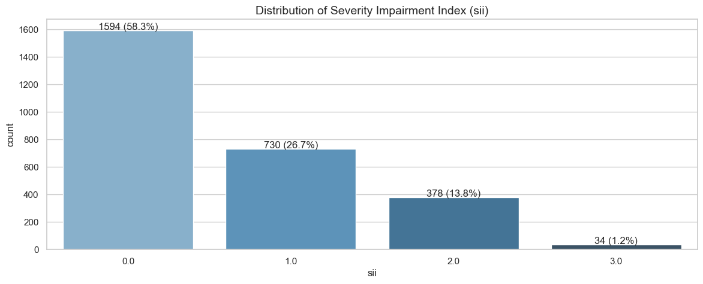
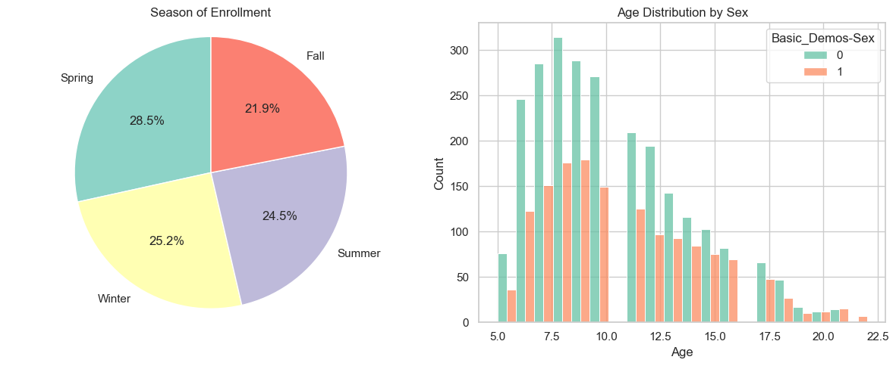
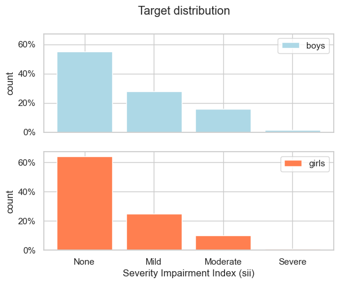

# Table of Contents
- [Explore Data](#explore-data)
- [A simple classification model](#a-simple-classification-model)

# Understanding the problem

The aim of this competition is to predict the Severity Impairment Index (sii), which measures the level of problematic internet use among children and adolescents, based on physical activity data and other features.

sii is derived from `PCIAT-PCIAT_Total`, the sum of scores from the Parent-Child Internet Addiction Test (PCIAT: 20 questions, scored 0-5).

Target Variable (sii) is defined as:
- 0: None (PCIAT-PCIAT_Total from 0 to 30)
- 1: Mild (PCIAT-PCIAT_Total from 31 to 49)
- 2: Moderate (PCIAT-PCIAT_Total from 50 to 79)
- 3: Severe (PCIAT-PCIAT_Total 80 and more)

sii is an ordinal categorical variable with four levels.

There are 3 popular approaches we can use:

1. Ordinal classification (ordinal logistic regression, models with custom ordinal loss functions)
2. Multiclass classification (treat sii as a nominal categorical variable without considering the order)
3. Regression (ignore the discrete nature of categories and treat sii as a continuous variable, then round prediction)


Also, another strategy involves predicting responses to each question of the Parent-Child Internet Addiction Test: i.e. pedict individual question scores as separate targets, sum the predicted scores to get the `PCIAT-PCIAT_Total` and map predictions to the corresponding sii category. But this method may seem a bit difficult for someone who has no knowledge of the related field


# Explore Data


### Train data


<div>

<table border="1" class="dataframe">
  <thead>
    <tr style="text-align: right;">
      <th></th>
      <th>id</th>
      <th>Basic_Demos-Enroll_Season</th>
      <th>Basic_Demos-Age</th>
      <th>Basic_Demos-Sex</th>
      <th>CGAS-Season</th>
      <th>CGAS-CGAS_Score</th>
      <th>Physical-Season</th>
      <th>Physical-BMI</th>
      <th>Physical-Height</th>
      <th>Physical-Weight</th>
      <th>...</th>
      <th>PCIAT-PCIAT_18</th>
      <th>PCIAT-PCIAT_19</th>
      <th>PCIAT-PCIAT_20</th>
      <th>PCIAT-PCIAT_Total</th>
      <th>SDS-Season</th>
      <th>SDS-SDS_Total_Raw</th>
      <th>SDS-SDS_Total_T</th>
      <th>PreInt_EduHx-Season</th>
      <th>PreInt_EduHx-computerinternet_hoursday</th>
      <th>sii</th>
    </tr>
  </thead>
  <tbody>
    <tr>
      <th>0</th>
      <td>00008ff9</td>
      <td>Fall</td>
      <td>5</td>
      <td>0</td>
      <td>Winter</td>
      <td>51.0</td>
      <td>Fall</td>
      <td>16.877316</td>
      <td>46.0</td>
      <td>50.8</td>
      <td>...</td>
      <td>4.0</td>
      <td>2.0</td>
      <td>4.0</td>
      <td>55.0</td>
      <td>NaN</td>
      <td>NaN</td>
      <td>NaN</td>
      <td>Fall</td>
      <td>3.0</td>
      <td>2.0</td>
    </tr>
    <tr>
      <th>1</th>
      <td>000fd460</td>
      <td>Summer</td>
      <td>9</td>
      <td>0</td>
      <td>NaN</td>
      <td>NaN</td>
      <td>Fall</td>
      <td>14.035590</td>
      <td>48.0</td>
      <td>46.0</td>
      <td>...</td>
      <td>0.0</td>
      <td>0.0</td>
      <td>0.0</td>
      <td>0.0</td>
      <td>Fall</td>
      <td>46.0</td>
      <td>64.0</td>
      <td>Summer</td>
      <td>0.0</td>
      <td>0.0</td>
    </tr>
    <tr>
      <th>2</th>
      <td>00105258</td>
      <td>Summer</td>
      <td>10</td>
      <td>1</td>
      <td>Fall</td>
      <td>71.0</td>
      <td>Fall</td>
      <td>16.648696</td>
      <td>56.5</td>
      <td>75.6</td>
      <td>...</td>
      <td>2.0</td>
      <td>1.0</td>
      <td>1.0</td>
      <td>28.0</td>
      <td>Fall</td>
      <td>38.0</td>
      <td>54.0</td>
      <td>Summer</td>
      <td>2.0</td>
      <td>0.0</td>
    </tr>
    <tr>
      <th>3</th>
      <td>00115b9f</td>
      <td>Winter</td>
      <td>9</td>
      <td>0</td>
      <td>Fall</td>
      <td>71.0</td>
      <td>Summer</td>
      <td>18.292347</td>
      <td>56.0</td>
      <td>81.6</td>
      <td>...</td>
      <td>3.0</td>
      <td>4.0</td>
      <td>1.0</td>
      <td>44.0</td>
      <td>Summer</td>
      <td>31.0</td>
      <td>45.0</td>
      <td>Winter</td>
      <td>0.0</td>
      <td>1.0</td>
    </tr>
    <tr>
      <th>4</th>
      <td>0016bb22</td>
      <td>Spring</td>
      <td>18</td>
      <td>1</td>
      <td>Summer</td>
      <td>NaN</td>
      <td>NaN</td>
      <td>NaN</td>
      <td>NaN</td>
      <td>NaN</td>
      <td>...</td>
      <td>NaN</td>
      <td>NaN</td>
      <td>NaN</td>
      <td>NaN</td>
      <td>NaN</td>
      <td>NaN</td>
      <td>NaN</td>
      <td>NaN</td>
      <td>NaN</td>
      <td>NaN</td>
    </tr>
  </tbody>
</table>

</div>


    Train shape: (3960, 82)
    

### Test data


<div>

<table border="1" class="dataframe">
  <thead>
    <tr style="text-align: right;">
      <th></th>
      <th>id</th>
      <th>Basic_Demos-Enroll_Season</th>
      <th>Basic_Demos-Age</th>
      <th>Basic_Demos-Sex</th>
      <th>CGAS-Season</th>
      <th>CGAS-CGAS_Score</th>
      <th>Physical-Season</th>
      <th>Physical-BMI</th>
      <th>Physical-Height</th>
      <th>Physical-Weight</th>
      <th>...</th>
      <th>BIA-BIA_TBW</th>
      <th>PAQ_A-Season</th>
      <th>PAQ_A-PAQ_A_Total</th>
      <th>PAQ_C-Season</th>
      <th>PAQ_C-PAQ_C_Total</th>
      <th>SDS-Season</th>
      <th>SDS-SDS_Total_Raw</th>
      <th>SDS-SDS_Total_T</th>
      <th>PreInt_EduHx-Season</th>
      <th>PreInt_EduHx-computerinternet_hoursday</th>
    </tr>
  </thead>
  <tbody>
    <tr>
      <th>0</th>
      <td>00008ff9</td>
      <td>Fall</td>
      <td>5</td>
      <td>0</td>
      <td>Winter</td>
      <td>51.0</td>
      <td>Fall</td>
      <td>16.877316</td>
      <td>46.0</td>
      <td>50.8</td>
      <td>...</td>
      <td>32.6909</td>
      <td>NaN</td>
      <td>NaN</td>
      <td>NaN</td>
      <td>NaN</td>
      <td>NaN</td>
      <td>NaN</td>
      <td>NaN</td>
      <td>Fall</td>
      <td>3.0</td>
    </tr>
    <tr>
      <th>1</th>
      <td>000fd460</td>
      <td>Summer</td>
      <td>9</td>
      <td>0</td>
      <td>NaN</td>
      <td>NaN</td>
      <td>Fall</td>
      <td>14.035590</td>
      <td>48.0</td>
      <td>46.0</td>
      <td>...</td>
      <td>27.0552</td>
      <td>NaN</td>
      <td>NaN</td>
      <td>Fall</td>
      <td>2.340</td>
      <td>Fall</td>
      <td>46.0</td>
      <td>64.0</td>
      <td>Summer</td>
      <td>0.0</td>
    </tr>
    <tr>
      <th>2</th>
      <td>00105258</td>
      <td>Summer</td>
      <td>10</td>
      <td>1</td>
      <td>Fall</td>
      <td>71.0</td>
      <td>Fall</td>
      <td>16.648696</td>
      <td>56.5</td>
      <td>75.6</td>
      <td>...</td>
      <td>NaN</td>
      <td>NaN</td>
      <td>NaN</td>
      <td>Summer</td>
      <td>2.170</td>
      <td>Fall</td>
      <td>38.0</td>
      <td>54.0</td>
      <td>Summer</td>
      <td>2.0</td>
    </tr>
    <tr>
      <th>3</th>
      <td>00115b9f</td>
      <td>Winter</td>
      <td>9</td>
      <td>0</td>
      <td>Fall</td>
      <td>71.0</td>
      <td>Summer</td>
      <td>18.292347</td>
      <td>56.0</td>
      <td>81.6</td>
      <td>...</td>
      <td>45.9966</td>
      <td>NaN</td>
      <td>NaN</td>
      <td>Winter</td>
      <td>2.451</td>
      <td>Summer</td>
      <td>31.0</td>
      <td>45.0</td>
      <td>Winter</td>
      <td>0.0</td>
    </tr>
    <tr>
      <th>4</th>
      <td>0016bb22</td>
      <td>Spring</td>
      <td>18</td>
      <td>1</td>
      <td>Summer</td>
      <td>NaN</td>
      <td>NaN</td>
      <td>NaN</td>
      <td>NaN</td>
      <td>NaN</td>
      <td>...</td>
      <td>NaN</td>
      <td>Summer</td>
      <td>1.04</td>
      <td>NaN</td>
      <td>NaN</td>
      <td>NaN</td>
      <td>NaN</td>
      <td>NaN</td>
      <td>NaN</td>
      <td>NaN</td>
    </tr>
  </tbody>
</table>

</div>


    Test shape: (20, 59)
    

## SII and PCIAT

Let's identify the features that are related to the target variable and that are not present in the test set.

**Parent-Child Internet Addiction Test (PCIAT):** contains 20 items (`PCIAT-PCIAT_01` to `PCIAT-PCIAT_20`), each assessing a different aspect of a child's behavior related to internet use. The items are answered on a scale (from 0 to 5), and the total score provides an indication of the severity of internet addiction.

We have season of participation in `PCIAT-Season` and total Score in `PCIAT-PCIAT_Total`; so there are 22 PCIAT test-related columns in total.

`PCIAT-PCIAT_Total` align with the corresponding sii categories, we will calculat its minimum and maximum scores for each sii category:


<div>

<table border="1" class="dataframe">
  <thead>
    <tr style="text-align: right;">
      <th></th>
      <th>Minimum PCIAT total Score</th>
      <th>Maximum total PCIAT Score</th>
    </tr>
    <tr>
      <th>sii</th>
      <th></th>
      <th></th>
    </tr>
  </thead>
  <tbody>
    <tr>
      <th>0.0</th>
      <td>0.0</td>
      <td>30.0</td>
    </tr>
    <tr>
      <th>1.0</th>
      <td>31.0</td>
      <td>49.0</td>
    </tr>
    <tr>
      <th>2.0</th>
      <td>50.0</td>
      <td>79.0</td>
    </tr>
    <tr>
      <th>3.0</th>
      <td>80.0</td>
      <td>93.0</td>
    </tr>
  </tbody>
</table>
</div>


    'Severity Impairment Index: 0-30=None; 31-49=Mild; 50-79=Moderate; 80-100=Severe'


### Check missing answers

Below We recalculate the SII based on `PCIAT_Total` and the maximum possible score if missing values were answered (5 points), ensuring that the recalculated SII meets the intended thresholds even with some missing answers.


Verification of rows with different original and recalculated SII:


<table id="T_3f915">
  <thead>
    <tr>
      <th class="blank level0" >&nbsp;</th>
      <th id="T_3f915_level0_col0" class="col_heading level0 col0" >PCIAT-PCIAT_01</th>
      <th id="T_3f915_level0_col1" class="col_heading level0 col1" >PCIAT-PCIAT_02</th>
      <th id="T_3f915_level0_col2" class="col_heading level0 col2" >PCIAT-PCIAT_03</th>
      <th id="T_3f915_level0_col3" class="col_heading level0 col3" >PCIAT-PCIAT_04</th>
      <th id="T_3f915_level0_col4" class="col_heading level0 col4" >PCIAT-PCIAT_05</th>
      <th id="T_3f915_level0_col5" class="col_heading level0 col5" >PCIAT-PCIAT_06</th>
      <th id="T_3f915_level0_col6" class="col_heading level0 col6" >PCIAT-PCIAT_07</th>
      <th id="T_3f915_level0_col7" class="col_heading level0 col7" >PCIAT-PCIAT_08</th>
      <th id="T_3f915_level0_col8" class="col_heading level0 col8" >PCIAT-PCIAT_09</th>
      <th id="T_3f915_level0_col9" class="col_heading level0 col9" >PCIAT-PCIAT_10</th>
      <th id="T_3f915_level0_col10" class="col_heading level0 col10" >PCIAT-PCIAT_11</th>
      <th id="T_3f915_level0_col11" class="col_heading level0 col11" >PCIAT-PCIAT_12</th>
      <th id="T_3f915_level0_col12" class="col_heading level0 col12" >PCIAT-PCIAT_13</th>
      <th id="T_3f915_level0_col13" class="col_heading level0 col13" >PCIAT-PCIAT_14</th>
      <th id="T_3f915_level0_col14" class="col_heading level0 col14" >PCIAT-PCIAT_15</th>
      <th id="T_3f915_level0_col15" class="col_heading level0 col15" >PCIAT-PCIAT_16</th>
      <th id="T_3f915_level0_col16" class="col_heading level0 col16" >PCIAT-PCIAT_17</th>
      <th id="T_3f915_level0_col17" class="col_heading level0 col17" >PCIAT-PCIAT_18</th>
      <th id="T_3f915_level0_col18" class="col_heading level0 col18" >PCIAT-PCIAT_19</th>
      <th id="T_3f915_level0_col19" class="col_heading level0 col19" >PCIAT-PCIAT_20</th>
      <th id="T_3f915_level0_col20" class="col_heading level0 col20" >PCIAT-PCIAT_Total</th>
      <th id="T_3f915_level0_col21" class="col_heading level0 col21" >sii</th>
      <th id="T_3f915_level0_col22" class="col_heading level0 col22" >recalc_sii</th>
    </tr>
  </thead>
  <tbody>
    <tr>
      <th id="T_3f915_level0_row0" class="row_heading level0 row0" >24</th>
      <td id="T_3f915_row0_col0" class="data row0 col0" >2.000000</td>
      <td id="T_3f915_row0_col1" class="data row0 col1" >2.000000</td>
      <td id="T_3f915_row0_col2" class="data row0 col2" >3.000000</td>
      <td id="T_3f915_row0_col3" class="data row0 col3" >1.000000</td>
      <td id="T_3f915_row0_col4" class="data row0 col4" >2.000000</td>
      <td id="T_3f915_row0_col5" class="data row0 col5" >1.000000</td>
      <td id="T_3f915_row0_col6" class="data row0 col6" >1.000000</td>
      <td id="T_3f915_row0_col7" class="data row0 col7" >1.000000</td>
      <td id="T_3f915_row0_col8" class="data row0 col8" >2.000000</td>
      <td id="T_3f915_row0_col9" class="data row0 col9" >1.000000</td>
      <td id="T_3f915_row0_col10" class="data row0 col10" >2.000000</td>
      <td id="T_3f915_row0_col11" class="data row0 col11" >1.000000</td>
      <td id="T_3f915_row0_col12" class="data row0 col12" >2.000000</td>
      <td id="T_3f915_row0_col13" class="data row0 col13" >1.000000</td>
      <td id="T_3f915_row0_col14" class="data row0 col14" >1.000000</td>
      <td id="T_3f915_row0_col15" class="data row0 col15" >2.000000</td>
      <td id="T_3f915_row0_col16" class="data row0 col16" >1.000000</td>
      <td id="T_3f915_row0_col17" class="data row0 col17" >2.000000</td>
      <td id="T_3f915_row0_col18" class="data row0 col18" >nan</td>
      <td id="T_3f915_row0_col19" class="data row0 col19" >2.000000</td>
      <td id="T_3f915_row0_col20" class="data row0 col20" >30.000000</td>
      <td id="T_3f915_row0_col21" class="data row0 col21" >0.000000</td>
      <td id="T_3f915_row0_col22" class="data row0 col22" >nan</td>
    </tr>
    <tr>
      <th id="T_3f915_level0_row1" class="row_heading level0 row1" >93</th>
      <td id="T_3f915_row1_col0" class="data row1 col0" >nan</td>
      <td id="T_3f915_row1_col1" class="data row1 col1" >nan</td>
      <td id="T_3f915_row1_col2" class="data row1 col2" >nan</td>
      <td id="T_3f915_row1_col3" class="data row1 col3" >nan</td>
      <td id="T_3f915_row1_col4" class="data row1 col4" >nan</td>
      <td id="T_3f915_row1_col5" class="data row1 col5" >nan</td>
      <td id="T_3f915_row1_col6" class="data row1 col6" >nan</td>
      <td id="T_3f915_row1_col7" class="data row1 col7" >nan</td>
      <td id="T_3f915_row1_col8" class="data row1 col8" >nan</td>
      <td id="T_3f915_row1_col9" class="data row1 col9" >nan</td>
      <td id="T_3f915_row1_col10" class="data row1 col10" >nan</td>
      <td id="T_3f915_row1_col11" class="data row1 col11" >nan</td>
      <td id="T_3f915_row1_col12" class="data row1 col12" >nan</td>
      <td id="T_3f915_row1_col13" class="data row1 col13" >nan</td>
      <td id="T_3f915_row1_col14" class="data row1 col14" >nan</td>
      <td id="T_3f915_row1_col15" class="data row1 col15" >nan</td>
      <td id="T_3f915_row1_col16" class="data row1 col16" >nan</td>
      <td id="T_3f915_row1_col17" class="data row1 col17" >nan</td>
      <td id="T_3f915_row1_col18" class="data row1 col18" >nan</td>
      <td id="T_3f915_row1_col19" class="data row1 col19" >nan</td>
      <td id="T_3f915_row1_col20" class="data row1 col20" >0.000000</td>
      <td id="T_3f915_row1_col21" class="data row1 col21" >0.000000</td>
      <td id="T_3f915_row1_col22" class="data row1 col22" >nan</td>
    </tr>
    <tr>
      <th id="T_3f915_level0_row2" class="row_heading level0 row2" >104</th>
      <td id="T_3f915_row2_col0" class="data row2 col0" >5.000000</td>
      <td id="T_3f915_row2_col1" class="data row2 col1" >2.000000</td>
      <td id="T_3f915_row2_col2" class="data row2 col2" >4.000000</td>
      <td id="T_3f915_row2_col3" class="data row2 col3" >2.000000</td>
      <td id="T_3f915_row2_col4" class="data row2 col4" >nan</td>
      <td id="T_3f915_row2_col5" class="data row2 col5" >2.000000</td>
      <td id="T_3f915_row2_col6" class="data row2 col6" >2.000000</td>
      <td id="T_3f915_row2_col7" class="data row2 col7" >2.000000</td>
      <td id="T_3f915_row2_col8" class="data row2 col8" >1.000000</td>
      <td id="T_3f915_row2_col9" class="data row2 col9" >2.000000</td>
      <td id="T_3f915_row2_col10" class="data row2 col10" >1.000000</td>
      <td id="T_3f915_row2_col11" class="data row2 col11" >1.000000</td>
      <td id="T_3f915_row2_col12" class="data row2 col12" >2.000000</td>
      <td id="T_3f915_row2_col13" class="data row2 col13" >2.000000</td>
      <td id="T_3f915_row2_col14" class="data row2 col14" >3.000000</td>
      <td id="T_3f915_row2_col15" class="data row2 col15" >3.000000</td>
      <td id="T_3f915_row2_col16" class="data row2 col16" >3.000000</td>
      <td id="T_3f915_row2_col17" class="data row2 col17" >3.000000</td>
      <td id="T_3f915_row2_col18" class="data row2 col18" >3.000000</td>
      <td id="T_3f915_row2_col19" class="data row2 col19" >2.000000</td>
      <td id="T_3f915_row2_col20" class="data row2 col20" >45.000000</td>
      <td id="T_3f915_row2_col21" class="data row2 col21" >1.000000</td>
      <td id="T_3f915_row2_col22" class="data row2 col22" >nan</td>
    </tr>
    <tr>
      <th id="T_3f915_level0_row3" class="row_heading level0 row3" >141</th>
      <td id="T_3f915_row3_col0" class="data row3 col0" >1.000000</td>
      <td id="T_3f915_row3_col1" class="data row3 col1" >2.000000</td>
      <td id="T_3f915_row3_col2" class="data row3 col2" >4.000000</td>
      <td id="T_3f915_row3_col3" class="data row3 col3" >2.000000</td>
      <td id="T_3f915_row3_col4" class="data row3 col4" >2.000000</td>
      <td id="T_3f915_row3_col5" class="data row3 col5" >2.000000</td>
      <td id="T_3f915_row3_col6" class="data row3 col6" >1.000000</td>
      <td id="T_3f915_row3_col7" class="data row3 col7" >3.000000</td>
      <td id="T_3f915_row3_col8" class="data row3 col8" >1.000000</td>
      <td id="T_3f915_row3_col9" class="data row3 col9" >1.000000</td>
      <td id="T_3f915_row3_col10" class="data row3 col10" >2.000000</td>
      <td id="T_3f915_row3_col11" class="data row3 col11" >0.000000</td>
      <td id="T_3f915_row3_col12" class="data row3 col12" >0.000000</td>
      <td id="T_3f915_row3_col13" class="data row3 col13" >0.000000</td>
      <td id="T_3f915_row3_col14" class="data row3 col14" >3.000000</td>
      <td id="T_3f915_row3_col15" class="data row3 col15" >0.000000</td>
      <td id="T_3f915_row3_col16" class="data row3 col16" >nan</td>
      <td id="T_3f915_row3_col17" class="data row3 col17" >0.000000</td>
      <td id="T_3f915_row3_col18" class="data row3 col18" >2.000000</td>
      <td id="T_3f915_row3_col19" class="data row3 col19" >0.000000</td>
      <td id="T_3f915_row3_col20" class="data row3 col20" >26.000000</td>
      <td id="T_3f915_row3_col21" class="data row3 col21" >0.000000</td>
      <td id="T_3f915_row3_col22" class="data row3 col22" >nan</td>
    </tr>
    <tr>
      <th id="T_3f915_level0_row4" class="row_heading level0 row4" >142</th>
      <td id="T_3f915_row4_col0" class="data row4 col0" >2.000000</td>
      <td id="T_3f915_row4_col1" class="data row4 col1" >2.000000</td>
      <td id="T_3f915_row4_col2" class="data row4 col2" >2.000000</td>
      <td id="T_3f915_row4_col3" class="data row4 col3" >1.000000</td>
      <td id="T_3f915_row4_col4" class="data row4 col4" >2.000000</td>
      <td id="T_3f915_row4_col5" class="data row4 col5" >1.000000</td>
      <td id="T_3f915_row4_col6" class="data row4 col6" >2.000000</td>
      <td id="T_3f915_row4_col7" class="data row4 col7" >1.000000</td>
      <td id="T_3f915_row4_col8" class="data row4 col8" >1.000000</td>
      <td id="T_3f915_row4_col9" class="data row4 col9" >1.000000</td>
      <td id="T_3f915_row4_col10" class="data row4 col10" >3.000000</td>
      <td id="T_3f915_row4_col11" class="data row4 col11" >0.000000</td>
      <td id="T_3f915_row4_col12" class="data row4 col12" >2.000000</td>
      <td id="T_3f915_row4_col13" class="data row4 col13" >1.000000</td>
      <td id="T_3f915_row4_col14" class="data row4 col14" >1.000000</td>
      <td id="T_3f915_row4_col15" class="data row4 col15" >1.000000</td>
      <td id="T_3f915_row4_col16" class="data row4 col16" >1.000000</td>
      <td id="T_3f915_row4_col17" class="data row4 col17" >1.000000</td>
      <td id="T_3f915_row4_col18" class="data row4 col18" >nan</td>
      <td id="T_3f915_row4_col19" class="data row4 col19" >1.000000</td>
      <td id="T_3f915_row4_col20" class="data row4 col20" >26.000000</td>
      <td id="T_3f915_row4_col21" class="data row4 col21" >0.000000</td>
      <td id="T_3f915_row4_col22" class="data row4 col22" >nan</td>
    </tr>
    <tr>
      <th id="T_3f915_level0_row5" class="row_heading level0 row5" >270</th>
      <td id="T_3f915_row5_col0" class="data row5 col0" >3.000000</td>
      <td id="T_3f915_row5_col1" class="data row5 col1" >3.000000</td>
      <td id="T_3f915_row5_col2" class="data row5 col2" >4.000000</td>
      <td id="T_3f915_row5_col3" class="data row5 col3" >2.000000</td>
      <td id="T_3f915_row5_col4" class="data row5 col4" >4.000000</td>
      <td id="T_3f915_row5_col5" class="data row5 col5" >2.000000</td>
      <td id="T_3f915_row5_col6" class="data row5 col6" >1.000000</td>
      <td id="T_3f915_row5_col7" class="data row5 col7" >3.000000</td>
      <td id="T_3f915_row5_col8" class="data row5 col8" >2.000000</td>
      <td id="T_3f915_row5_col9" class="data row5 col9" >2.000000</td>
      <td id="T_3f915_row5_col10" class="data row5 col10" >4.000000</td>
      <td id="T_3f915_row5_col11" class="data row5 col11" >0.000000</td>
      <td id="T_3f915_row5_col12" class="data row5 col12" >2.000000</td>
      <td id="T_3f915_row5_col13" class="data row5 col13" >1.000000</td>
      <td id="T_3f915_row5_col14" class="data row5 col14" >4.000000</td>
      <td id="T_3f915_row5_col15" class="data row5 col15" >nan</td>
      <td id="T_3f915_row5_col16" class="data row5 col16" >2.000000</td>
      <td id="T_3f915_row5_col17" class="data row5 col17" >3.000000</td>
      <td id="T_3f915_row5_col18" class="data row5 col18" >4.000000</td>
      <td id="T_3f915_row5_col19" class="data row5 col19" >2.000000</td>
      <td id="T_3f915_row5_col20" class="data row5 col20" >48.000000</td>
      <td id="T_3f915_row5_col21" class="data row5 col21" >1.000000</td>
      <td id="T_3f915_row5_col22" class="data row5 col22" >nan</td>
    </tr>
    <tr>
      <th id="T_3f915_level0_row6" class="row_heading level0 row6" >368</th>
      <td id="T_3f915_row6_col0" class="data row6 col0" >2.000000</td>
      <td id="T_3f915_row6_col1" class="data row6 col1" >3.000000</td>
      <td id="T_3f915_row6_col2" class="data row6 col2" >4.000000</td>
      <td id="T_3f915_row6_col3" class="data row6 col3" >2.000000</td>
      <td id="T_3f915_row6_col4" class="data row6 col4" >5.000000</td>
      <td id="T_3f915_row6_col5" class="data row6 col5" >1.000000</td>
      <td id="T_3f915_row6_col6" class="data row6 col6" >2.000000</td>
      <td id="T_3f915_row6_col7" class="data row6 col7" >nan</td>
      <td id="T_3f915_row6_col8" class="data row6 col8" >nan</td>
      <td id="T_3f915_row6_col9" class="data row6 col9" >nan</td>
      <td id="T_3f915_row6_col10" class="data row6 col10" >2.000000</td>
      <td id="T_3f915_row6_col11" class="data row6 col11" >1.000000</td>
      <td id="T_3f915_row6_col12" class="data row6 col12" >1.000000</td>
      <td id="T_3f915_row6_col13" class="data row6 col13" >2.000000</td>
      <td id="T_3f915_row6_col14" class="data row6 col14" >2.000000</td>
      <td id="T_3f915_row6_col15" class="data row6 col15" >1.000000</td>
      <td id="T_3f915_row6_col16" class="data row6 col16" >2.000000</td>
      <td id="T_3f915_row6_col17" class="data row6 col17" >1.000000</td>
      <td id="T_3f915_row6_col18" class="data row6 col18" >nan</td>
      <td id="T_3f915_row6_col19" class="data row6 col19" >nan</td>
      <td id="T_3f915_row6_col20" class="data row6 col20" >31.000000</td>
      <td id="T_3f915_row6_col21" class="data row6 col21" >1.000000</td>
      <td id="T_3f915_row6_col22" class="data row6 col22" >nan</td>
    </tr>
    <tr>
      <th id="T_3f915_level0_row7" class="row_heading level0 row7" >592</th>
      <td id="T_3f915_row7_col0" class="data row7 col0" >3.000000</td>
      <td id="T_3f915_row7_col1" class="data row7 col1" >0.000000</td>
      <td id="T_3f915_row7_col2" class="data row7 col2" >3.000000</td>
      <td id="T_3f915_row7_col3" class="data row7 col3" >0.000000</td>
      <td id="T_3f915_row7_col4" class="data row7 col4" >3.000000</td>
      <td id="T_3f915_row7_col5" class="data row7 col5" >1.000000</td>
      <td id="T_3f915_row7_col6" class="data row7 col6" >0.000000</td>
      <td id="T_3f915_row7_col7" class="data row7 col7" >1.000000</td>
      <td id="T_3f915_row7_col8" class="data row7 col8" >1.000000</td>
      <td id="T_3f915_row7_col9" class="data row7 col9" >1.000000</td>
      <td id="T_3f915_row7_col10" class="data row7 col10" >2.000000</td>
      <td id="T_3f915_row7_col11" class="data row7 col11" >0.000000</td>
      <td id="T_3f915_row7_col12" class="data row7 col12" >1.000000</td>
      <td id="T_3f915_row7_col13" class="data row7 col13" >nan</td>
      <td id="T_3f915_row7_col14" class="data row7 col14" >nan</td>
      <td id="T_3f915_row7_col15" class="data row7 col15" >1.000000</td>
      <td id="T_3f915_row7_col16" class="data row7 col16" >2.000000</td>
      <td id="T_3f915_row7_col17" class="data row7 col17" >1.000000</td>
      <td id="T_3f915_row7_col18" class="data row7 col18" >1.000000</td>
      <td id="T_3f915_row7_col19" class="data row7 col19" >0.000000</td>
      <td id="T_3f915_row7_col20" class="data row7 col20" >21.000000</td>
      <td id="T_3f915_row7_col21" class="data row7 col21" >0.000000</td>
      <td id="T_3f915_row7_col22" class="data row7 col22" >nan</td>
    </tr>
    <tr>
      <th id="T_3f915_level0_row8" class="row_heading level0 row8" >724</th>
      <td id="T_3f915_row8_col0" class="data row8 col0" >3.000000</td>
      <td id="T_3f915_row8_col1" class="data row8 col1" >2.000000</td>
      <td id="T_3f915_row8_col2" class="data row8 col2" >4.000000</td>
      <td id="T_3f915_row8_col3" class="data row8 col3" >2.000000</td>
      <td id="T_3f915_row8_col4" class="data row8 col4" >2.000000</td>
      <td id="T_3f915_row8_col5" class="data row8 col5" >1.000000</td>
      <td id="T_3f915_row8_col6" class="data row8 col6" >0.000000</td>
      <td id="T_3f915_row8_col7" class="data row8 col7" >nan</td>
      <td id="T_3f915_row8_col8" class="data row8 col8" >1.000000</td>
      <td id="T_3f915_row8_col9" class="data row8 col9" >1.000000</td>
      <td id="T_3f915_row8_col10" class="data row8 col10" >1.000000</td>
      <td id="T_3f915_row8_col11" class="data row8 col11" >1.000000</td>
      <td id="T_3f915_row8_col12" class="data row8 col12" >2.000000</td>
      <td id="T_3f915_row8_col13" class="data row8 col13" >1.000000</td>
      <td id="T_3f915_row8_col14" class="data row8 col14" >2.000000</td>
      <td id="T_3f915_row8_col15" class="data row8 col15" >1.000000</td>
      <td id="T_3f915_row8_col16" class="data row8 col16" >1.000000</td>
      <td id="T_3f915_row8_col17" class="data row8 col17" >3.000000</td>
      <td id="T_3f915_row8_col18" class="data row8 col18" >0.000000</td>
      <td id="T_3f915_row8_col19" class="data row8 col19" >1.000000</td>
      <td id="T_3f915_row8_col20" class="data row8 col20" >29.000000</td>
      <td id="T_3f915_row8_col21" class="data row8 col21" >0.000000</td>
      <td id="T_3f915_row8_col22" class="data row8 col22" >nan</td>
    </tr>
    <tr>
      <th id="T_3f915_level0_row9" class="row_heading level0 row9" >877</th>
      <td id="T_3f915_row9_col0" class="data row9 col0" >5.000000</td>
      <td id="T_3f915_row9_col1" class="data row9 col1" >5.000000</td>
      <td id="T_3f915_row9_col2" class="data row9 col2" >5.000000</td>
      <td id="T_3f915_row9_col3" class="data row9 col3" >4.000000</td>
      <td id="T_3f915_row9_col4" class="data row9 col4" >5.000000</td>
      <td id="T_3f915_row9_col5" class="data row9 col5" >0.000000</td>
      <td id="T_3f915_row9_col6" class="data row9 col6" >5.000000</td>
      <td id="T_3f915_row9_col7" class="data row9 col7" >5.000000</td>
      <td id="T_3f915_row9_col8" class="data row9 col8" >5.000000</td>
      <td id="T_3f915_row9_col9" class="data row9 col9" >5.000000</td>
      <td id="T_3f915_row9_col10" class="data row9 col10" >4.000000</td>
      <td id="T_3f915_row9_col11" class="data row9 col11" >nan</td>
      <td id="T_3f915_row9_col12" class="data row9 col12" >4.000000</td>
      <td id="T_3f915_row9_col13" class="data row9 col13" >5.000000</td>
      <td id="T_3f915_row9_col14" class="data row9 col14" >5.000000</td>
      <td id="T_3f915_row9_col15" class="data row9 col15" >1.000000</td>
      <td id="T_3f915_row9_col16" class="data row9 col16" >5.000000</td>
      <td id="T_3f915_row9_col17" class="data row9 col17" >0.000000</td>
      <td id="T_3f915_row9_col18" class="data row9 col18" >5.000000</td>
      <td id="T_3f915_row9_col19" class="data row9 col19" >5.000000</td>
      <td id="T_3f915_row9_col20" class="data row9 col20" >78.000000</td>
      <td id="T_3f915_row9_col21" class="data row9 col21" >2.000000</td>
      <td id="T_3f915_row9_col22" class="data row9 col22" >nan</td>
    </tr>
    <tr>
      <th id="T_3f915_level0_row10" class="row_heading level0 row10" >1706</th>
      <td id="T_3f915_row10_col0" class="data row10 col0" >nan</td>
      <td id="T_3f915_row10_col1" class="data row10 col1" >nan</td>
      <td id="T_3f915_row10_col2" class="data row10 col2" >nan</td>
      <td id="T_3f915_row10_col3" class="data row10 col3" >nan</td>
      <td id="T_3f915_row10_col4" class="data row10 col4" >nan</td>
      <td id="T_3f915_row10_col5" class="data row10 col5" >nan</td>
      <td id="T_3f915_row10_col6" class="data row10 col6" >nan</td>
      <td id="T_3f915_row10_col7" class="data row10 col7" >nan</td>
      <td id="T_3f915_row10_col8" class="data row10 col8" >nan</td>
      <td id="T_3f915_row10_col9" class="data row10 col9" >nan</td>
      <td id="T_3f915_row10_col10" class="data row10 col10" >0.000000</td>
      <td id="T_3f915_row10_col11" class="data row10 col11" >0.000000</td>
      <td id="T_3f915_row10_col12" class="data row10 col12" >0.000000</td>
      <td id="T_3f915_row10_col13" class="data row10 col13" >0.000000</td>
      <td id="T_3f915_row10_col14" class="data row10 col14" >0.000000</td>
      <td id="T_3f915_row10_col15" class="data row10 col15" >0.000000</td>
      <td id="T_3f915_row10_col16" class="data row10 col16" >0.000000</td>
      <td id="T_3f915_row10_col17" class="data row10 col17" >0.000000</td>
      <td id="T_3f915_row10_col18" class="data row10 col18" >0.000000</td>
      <td id="T_3f915_row10_col19" class="data row10 col19" >0.000000</td>
      <td id="T_3f915_row10_col20" class="data row10 col20" >0.000000</td>
      <td id="T_3f915_row10_col21" class="data row10 col21" >0.000000</td>
      <td id="T_3f915_row10_col22" class="data row10 col22" >nan</td>
    </tr>
    <tr>
      <th id="T_3f915_level0_row11" class="row_heading level0 row11" >1911</th>
      <td id="T_3f915_row11_col0" class="data row11 col0" >nan</td>
      <td id="T_3f915_row11_col1" class="data row11 col1" >5.000000</td>
      <td id="T_3f915_row11_col2" class="data row11 col2" >5.000000</td>
      <td id="T_3f915_row11_col3" class="data row11 col3" >nan</td>
      <td id="T_3f915_row11_col4" class="data row11 col4" >3.000000</td>
      <td id="T_3f915_row11_col5" class="data row11 col5" >4.000000</td>
      <td id="T_3f915_row11_col6" class="data row11 col6" >0.000000</td>
      <td id="T_3f915_row11_col7" class="data row11 col7" >1.000000</td>
      <td id="T_3f915_row11_col8" class="data row11 col8" >5.000000</td>
      <td id="T_3f915_row11_col9" class="data row11 col9" >0.000000</td>
      <td id="T_3f915_row11_col10" class="data row11 col10" >4.000000</td>
      <td id="T_3f915_row11_col11" class="data row11 col11" >0.000000</td>
      <td id="T_3f915_row11_col12" class="data row11 col12" >0.000000</td>
      <td id="T_3f915_row11_col13" class="data row11 col13" >0.000000</td>
      <td id="T_3f915_row11_col14" class="data row11 col14" >5.000000</td>
      <td id="T_3f915_row11_col15" class="data row11 col15" >3.000000</td>
      <td id="T_3f915_row11_col16" class="data row11 col16" >nan</td>
      <td id="T_3f915_row11_col17" class="data row11 col17" >3.000000</td>
      <td id="T_3f915_row11_col18" class="data row11 col18" >0.000000</td>
      <td id="T_3f915_row11_col19" class="data row11 col19" >0.000000</td>
      <td id="T_3f915_row11_col20" class="data row11 col20" >38.000000</td>
      <td id="T_3f915_row11_col21" class="data row11 col21" >1.000000</td>
      <td id="T_3f915_row11_col22" class="data row11 col22" >nan</td>
    </tr>
    <tr>
      <th id="T_3f915_level0_row12" class="row_heading level0 row12" >2285</th>
      <td id="T_3f915_row12_col0" class="data row12 col0" >2.000000</td>
      <td id="T_3f915_row12_col1" class="data row12 col1" >2.000000</td>
      <td id="T_3f915_row12_col2" class="data row12 col2" >2.000000</td>
      <td id="T_3f915_row12_col3" class="data row12 col3" >1.000000</td>
      <td id="T_3f915_row12_col4" class="data row12 col4" >2.000000</td>
      <td id="T_3f915_row12_col5" class="data row12 col5" >1.000000</td>
      <td id="T_3f915_row12_col6" class="data row12 col6" >0.000000</td>
      <td id="T_3f915_row12_col7" class="data row12 col7" >2.000000</td>
      <td id="T_3f915_row12_col8" class="data row12 col8" >2.000000</td>
      <td id="T_3f915_row12_col9" class="data row12 col9" >2.000000</td>
      <td id="T_3f915_row12_col10" class="data row12 col10" >2.000000</td>
      <td id="T_3f915_row12_col11" class="data row12 col11" >0.000000</td>
      <td id="T_3f915_row12_col12" class="data row12 col12" >2.000000</td>
      <td id="T_3f915_row12_col13" class="data row12 col13" >2.000000</td>
      <td id="T_3f915_row12_col14" class="data row12 col14" >nan</td>
      <td id="T_3f915_row12_col15" class="data row12 col15" >1.000000</td>
      <td id="T_3f915_row12_col16" class="data row12 col16" >2.000000</td>
      <td id="T_3f915_row12_col17" class="data row12 col17" >nan</td>
      <td id="T_3f915_row12_col18" class="data row12 col18" >1.000000</td>
      <td id="T_3f915_row12_col19" class="data row12 col19" >1.000000</td>
      <td id="T_3f915_row12_col20" class="data row12 col20" >27.000000</td>
      <td id="T_3f915_row12_col21" class="data row12 col21" >0.000000</td>
      <td id="T_3f915_row12_col22" class="data row12 col22" >nan</td>
    </tr>
    <tr>
      <th id="T_3f915_level0_row13" class="row_heading level0 row13" >3037</th>
      <td id="T_3f915_row13_col0" class="data row13 col0" >3.000000</td>
      <td id="T_3f915_row13_col1" class="data row13 col1" >4.000000</td>
      <td id="T_3f915_row13_col2" class="data row13 col2" >4.000000</td>
      <td id="T_3f915_row13_col3" class="data row13 col3" >0.000000</td>
      <td id="T_3f915_row13_col4" class="data row13 col4" >4.000000</td>
      <td id="T_3f915_row13_col5" class="data row13 col5" >0.000000</td>
      <td id="T_3f915_row13_col6" class="data row13 col6" >0.000000</td>
      <td id="T_3f915_row13_col7" class="data row13 col7" >4.000000</td>
      <td id="T_3f915_row13_col8" class="data row13 col8" >2.000000</td>
      <td id="T_3f915_row13_col9" class="data row13 col9" >2.000000</td>
      <td id="T_3f915_row13_col10" class="data row13 col10" >4.000000</td>
      <td id="T_3f915_row13_col11" class="data row13 col11" >0.000000</td>
      <td id="T_3f915_row13_col12" class="data row13 col12" >4.000000</td>
      <td id="T_3f915_row13_col13" class="data row13 col13" >1.000000</td>
      <td id="T_3f915_row13_col14" class="data row13 col14" >4.000000</td>
      <td id="T_3f915_row13_col15" class="data row13 col15" >4.000000</td>
      <td id="T_3f915_row13_col16" class="data row13 col16" >4.000000</td>
      <td id="T_3f915_row13_col17" class="data row13 col17" >nan</td>
      <td id="T_3f915_row13_col18" class="data row13 col18" >nan</td>
      <td id="T_3f915_row13_col19" class="data row13 col19" >1.000000</td>
      <td id="T_3f915_row13_col20" class="data row13 col20" >45.000000</td>
      <td id="T_3f915_row13_col21" class="data row13 col21" >1.000000</td>
      <td id="T_3f915_row13_col22" class="data row13 col22" >nan</td>
    </tr>
    <tr>
      <th id="T_3f915_level0_row14" class="row_heading level0 row14" >3500</th>
      <td id="T_3f915_row14_col0" class="data row14 col0" >3.000000</td>
      <td id="T_3f915_row14_col1" class="data row14 col1" >3.000000</td>
      <td id="T_3f915_row14_col2" class="data row14 col2" >2.000000</td>
      <td id="T_3f915_row14_col3" class="data row14 col3" >3.000000</td>
      <td id="T_3f915_row14_col4" class="data row14 col4" >4.000000</td>
      <td id="T_3f915_row14_col5" class="data row14 col5" >4.000000</td>
      <td id="T_3f915_row14_col6" class="data row14 col6" >4.000000</td>
      <td id="T_3f915_row14_col7" class="data row14 col7" >2.000000</td>
      <td id="T_3f915_row14_col8" class="data row14 col8" >3.000000</td>
      <td id="T_3f915_row14_col9" class="data row14 col9" >3.000000</td>
      <td id="T_3f915_row14_col10" class="data row14 col10" >2.000000</td>
      <td id="T_3f915_row14_col11" class="data row14 col11" >1.000000</td>
      <td id="T_3f915_row14_col12" class="data row14 col12" >2.000000</td>
      <td id="T_3f915_row14_col13" class="data row14 col13" >2.000000</td>
      <td id="T_3f915_row14_col14" class="data row14 col14" >2.000000</td>
      <td id="T_3f915_row14_col15" class="data row14 col15" >nan</td>
      <td id="T_3f915_row14_col16" class="data row14 col16" >2.000000</td>
      <td id="T_3f915_row14_col17" class="data row14 col17" >2.000000</td>
      <td id="T_3f915_row14_col18" class="data row14 col18" >2.000000</td>
      <td id="T_3f915_row14_col19" class="data row14 col19" >1.000000</td>
      <td id="T_3f915_row14_col20" class="data row14 col20" >47.000000</td>
      <td id="T_3f915_row14_col21" class="data row14 col21" >1.000000</td>
      <td id="T_3f915_row14_col22" class="data row14 col22" >nan</td>
    </tr>
    <tr>
      <th id="T_3f915_level0_row15" class="row_heading level0 row15" >3672</th>
      <td id="T_3f915_row15_col0" class="data row15 col0" >5.000000</td>
      <td id="T_3f915_row15_col1" class="data row15 col1" >5.000000</td>
      <td id="T_3f915_row15_col2" class="data row15 col2" >1.000000</td>
      <td id="T_3f915_row15_col3" class="data row15 col3" >0.000000</td>
      <td id="T_3f915_row15_col4" class="data row15 col4" >nan</td>
      <td id="T_3f915_row15_col5" class="data row15 col5" >1.000000</td>
      <td id="T_3f915_row15_col6" class="data row15 col6" >0.000000</td>
      <td id="T_3f915_row15_col7" class="data row15 col7" >0.000000</td>
      <td id="T_3f915_row15_col8" class="data row15 col8" >0.000000</td>
      <td id="T_3f915_row15_col9" class="data row15 col9" >0.000000</td>
      <td id="T_3f915_row15_col10" class="data row15 col10" >5.000000</td>
      <td id="T_3f915_row15_col11" class="data row15 col11" >0.000000</td>
      <td id="T_3f915_row15_col12" class="data row15 col12" >5.000000</td>
      <td id="T_3f915_row15_col13" class="data row15 col13" >1.000000</td>
      <td id="T_3f915_row15_col14" class="data row15 col14" >5.000000</td>
      <td id="T_3f915_row15_col15" class="data row15 col15" >5.000000</td>
      <td id="T_3f915_row15_col16" class="data row15 col16" >3.000000</td>
      <td id="T_3f915_row15_col17" class="data row15 col17" >5.000000</td>
      <td id="T_3f915_row15_col18" class="data row15 col18" >5.000000</td>
      <td id="T_3f915_row15_col19" class="data row15 col19" >3.000000</td>
      <td id="T_3f915_row15_col20" class="data row15 col20" >49.000000</td>
      <td id="T_3f915_row15_col21" class="data row15 col21" >1.000000</td>
      <td id="T_3f915_row15_col22" class="data row15 col22" >nan</td>
    </tr>
    <tr>
      <th id="T_3f915_level0_row16" class="row_heading level0 row16" >3757</th>
      <td id="T_3f915_row16_col0" class="data row16 col0" >2.000000</td>
      <td id="T_3f915_row16_col1" class="data row16 col1" >2.000000</td>
      <td id="T_3f915_row16_col2" class="data row16 col2" >4.000000</td>
      <td id="T_3f915_row16_col3" class="data row16 col3" >0.000000</td>
      <td id="T_3f915_row16_col4" class="data row16 col4" >5.000000</td>
      <td id="T_3f915_row16_col5" class="data row16 col5" >1.000000</td>
      <td id="T_3f915_row16_col6" class="data row16 col6" >nan</td>
      <td id="T_3f915_row16_col7" class="data row16 col7" >5.000000</td>
      <td id="T_3f915_row16_col8" class="data row16 col8" >nan</td>
      <td id="T_3f915_row16_col9" class="data row16 col9" >0.000000</td>
      <td id="T_3f915_row16_col10" class="data row16 col10" >0.000000</td>
      <td id="T_3f915_row16_col11" class="data row16 col11" >0.000000</td>
      <td id="T_3f915_row16_col12" class="data row16 col12" >0.000000</td>
      <td id="T_3f915_row16_col13" class="data row16 col13" >4.000000</td>
      <td id="T_3f915_row16_col14" class="data row16 col14" >4.000000</td>
      <td id="T_3f915_row16_col15" class="data row16 col15" >5.000000</td>
      <td id="T_3f915_row16_col16" class="data row16 col16" >2.000000</td>
      <td id="T_3f915_row16_col17" class="data row16 col17" >4.000000</td>
      <td id="T_3f915_row16_col18" class="data row16 col18" >0.000000</td>
      <td id="T_3f915_row16_col19" class="data row16 col19" >4.000000</td>
      <td id="T_3f915_row16_col20" class="data row16 col20" >42.000000</td>
      <td id="T_3f915_row16_col21" class="data row16 col21" >1.000000</td>
      <td id="T_3f915_row16_col22" class="data row16 col22" >nan</td>
    </tr>
  </tbody>
</table>


For now, we can conclude that the SII score is sometimes incorrect.


Also, all columns have a substantial proportion of missing values, except id and the three basic demographic columns for sex, age and season of enrollment. Even the target sii has missing values:


<div>

<table border="1" class="dataframe">
  <thead>
    <tr style="text-align: right;">
      <th></th>
      <th>Column</th>
      <th>mis_count</th>
      <th>Missing_Percentage</th>
    </tr>
  </thead>
  <tbody>
    <tr>
      <th>0</th>
      <td>PAQ_A-Season</td>
      <td>3485</td>
      <td>88.005051</td>
    </tr>
    <tr>
      <th>1</th>
      <td>PAQ_A-PAQ_A_Total</td>
      <td>3485</td>
      <td>88.005051</td>
    </tr>
    <tr>
      <th>2</th>
      <td>Fitness_Endurance-Time_Mins</td>
      <td>3220</td>
      <td>81.313131</td>
    </tr>
    <tr>
      <th>3</th>
      <td>Fitness_Endurance-Time_Sec</td>
      <td>3220</td>
      <td>81.313131</td>
    </tr>
    <tr>
      <th>4</th>
      <td>Fitness_Endurance-Max_Stage</td>
      <td>3217</td>
      <td>81.237374</td>
    </tr>
    <tr>
      <th>5</th>
      <td>Physical-Waist_Circumference</td>
      <td>3062</td>
      <td>77.323232</td>
    </tr>
    <tr>
      <th>6</th>
      <td>FGC-FGC_GSND_Zone</td>
      <td>2898</td>
      <td>73.181818</td>
    </tr>
    <tr>
      <th>7</th>
      <td>FGC-FGC_GSD_Zone</td>
      <td>2897</td>
      <td>73.156566</td>
    </tr>
    <tr>
      <th>8</th>
      <td>FGC-FGC_GSD</td>
      <td>2886</td>
      <td>72.878788</td>
    </tr>
    <tr>
      <th>9</th>
      <td>FGC-FGC_GSND</td>
      <td>2886</td>
      <td>72.878788</td>
    </tr>
    <tr>
      <th>10</th>
      <td>Fitness_Endurance-Season</td>
      <td>2652</td>
      <td>66.969697</td>
    </tr>
    <tr>
      <th>11</th>
      <td>PAQ_C-Season</td>
      <td>2239</td>
      <td>56.540404</td>
    </tr>
    <tr>
      <th>12</th>
      <td>PAQ_C-PAQ_C_Total</td>
      <td>2239</td>
      <td>56.540404</td>
    </tr>
    <tr>
      <th>13</th>
      <td>BIA-BIA_BMR</td>
      <td>1969</td>
      <td>49.722222</td>
    </tr>
    <tr>
      <th>14</th>
      <td>BIA-BIA_DEE</td>
      <td>1969</td>
      <td>49.722222</td>
    </tr>
    <tr>
      <th>15</th>
      <td>BIA-BIA_ECW</td>
      <td>1969</td>
      <td>49.722222</td>
    </tr>
    <tr>
      <th>16</th>
      <td>BIA-BIA_FFM</td>
      <td>1969</td>
      <td>49.722222</td>
    </tr>
    <tr>
      <th>17</th>
      <td>BIA-BIA_FFMI</td>
      <td>1969</td>
      <td>49.722222</td>
    </tr>
    <tr>
      <th>18</th>
      <td>BIA-BIA_BMC</td>
      <td>1969</td>
      <td>49.722222</td>
    </tr>
    <tr>
      <th>19</th>
      <td>BIA-BIA_Activity_Level_num</td>
      <td>1969</td>
      <td>49.722222</td>
    </tr>
    <tr>
      <th>20</th>
      <td>BIA-BIA_LST</td>
      <td>1969</td>
      <td>49.722222</td>
    </tr>
    <tr>
      <th>21</th>
      <td>BIA-BIA_LDM</td>
      <td>1969</td>
      <td>49.722222</td>
    </tr>
    <tr>
      <th>22</th>
      <td>BIA-BIA_Fat</td>
      <td>1969</td>
      <td>49.722222</td>
    </tr>
    <tr>
      <th>23</th>
      <td>BIA-BIA_FMI</td>
      <td>1969</td>
      <td>49.722222</td>
    </tr>
    <tr>
      <th>24</th>
      <td>BIA-BIA_SMM</td>
      <td>1969</td>
      <td>49.722222</td>
    </tr>
    <tr>
      <th>25</th>
      <td>BIA-BIA_TBW</td>
      <td>1969</td>
      <td>49.722222</td>
    </tr>
    <tr>
      <th>26</th>
      <td>BIA-BIA_Frame_num</td>
      <td>1969</td>
      <td>49.722222</td>
    </tr>
    <tr>
      <th>27</th>
      <td>BIA-BIA_ICW</td>
      <td>1969</td>
      <td>49.722222</td>
    </tr>
    <tr>
      <th>28</th>
      <td>BIA-BIA_BMI</td>
      <td>1969</td>
      <td>49.722222</td>
    </tr>
    <tr>
      <th>29</th>
      <td>BIA-Season</td>
      <td>1815</td>
      <td>45.833333</td>
    </tr>
    <tr>
      <th>30</th>
      <td>FGC-FGC_SRL_Zone</td>
      <td>1693</td>
      <td>42.752525</td>
    </tr>
    <tr>
      <th>31</th>
      <td>FGC-FGC_SRR_Zone</td>
      <td>1691</td>
      <td>42.702020</td>
    </tr>
    <tr>
      <th>32</th>
      <td>FGC-FGC_PU_Zone</td>
      <td>1689</td>
      <td>42.651515</td>
    </tr>
    <tr>
      <th>33</th>
      <td>FGC-FGC_CU_Zone</td>
      <td>1678</td>
      <td>42.373737</td>
    </tr>
    <tr>
      <th>34</th>
      <td>FGC-FGC_TL_Zone</td>
      <td>1675</td>
      <td>42.297980</td>
    </tr>
    <tr>
      <th>35</th>
      <td>FGC-FGC_SRL</td>
      <td>1655</td>
      <td>41.792929</td>
    </tr>
    <tr>
      <th>36</th>
      <td>FGC-FGC_SRR</td>
      <td>1653</td>
      <td>41.742424</td>
    </tr>
    <tr>
      <th>37</th>
      <td>FGC-FGC_PU</td>
      <td>1650</td>
      <td>41.666667</td>
    </tr>
    <tr>
      <th>38</th>
      <td>FGC-FGC_CU</td>
      <td>1638</td>
      <td>41.363636</td>
    </tr>
    <tr>
      <th>39</th>
      <td>FGC-FGC_TL</td>
      <td>1636</td>
      <td>41.313131</td>
    </tr>
    <tr>
      <th>40</th>
      <td>CGAS-CGAS_Score</td>
      <td>1539</td>
      <td>38.863636</td>
    </tr>
    <tr>
      <th>41</th>
      <td>CGAS-Season</td>
      <td>1405</td>
      <td>35.479798</td>
    </tr>
    <tr>
      <th>42</th>
      <td>SDS-SDS_Total_T</td>
      <td>1354</td>
      <td>34.191919</td>
    </tr>
    <tr>
      <th>43</th>
      <td>SDS-SDS_Total_Raw</td>
      <td>1351</td>
      <td>34.116162</td>
    </tr>
    <tr>
      <th>44</th>
      <td>SDS-Season</td>
      <td>1342</td>
      <td>33.888889</td>
    </tr>
    <tr>
      <th>45</th>
      <td>sii</td>
      <td>1224</td>
      <td>30.909091</td>
    </tr>
    <tr>
      <th>46</th>
      <td>Physical-Systolic_BP</td>
      <td>1006</td>
      <td>25.404040</td>
    </tr>
    <tr>
      <th>47</th>
      <td>Physical-Diastolic_BP</td>
      <td>1006</td>
      <td>25.404040</td>
    </tr>
    <tr>
      <th>48</th>
      <td>Physical-HeartRate</td>
      <td>993</td>
      <td>25.075758</td>
    </tr>
    <tr>
      <th>49</th>
      <td>Physical-BMI</td>
      <td>938</td>
      <td>23.686869</td>
    </tr>
    <tr>
      <th>50</th>
      <td>Physical-Height</td>
      <td>933</td>
      <td>23.560606</td>
    </tr>
    <tr>
      <th>51</th>
      <td>Physical-Weight</td>
      <td>884</td>
      <td>22.323232</td>
    </tr>
    <tr>
      <th>52</th>
      <td>PreInt_EduHx-computerinternet_hoursday</td>
      <td>659</td>
      <td>16.641414</td>
    </tr>
    <tr>
      <th>53</th>
      <td>Physical-Season</td>
      <td>650</td>
      <td>16.414141</td>
    </tr>
    <tr>
      <th>54</th>
      <td>FGC-Season</td>
      <td>614</td>
      <td>15.505051</td>
    </tr>
    <tr>
      <th>55</th>
      <td>PreInt_EduHx-Season</td>
      <td>420</td>
      <td>10.606061</td>
    </tr>
  </tbody>
</table>
</div>


### Plot distribution of the target variable

The target variable sii is ordinal and imbalanced, with the majority of participants having a score of 0 (None) or 1 (Mild), 2 (Moderate) 14% and only 1.2% for 3 (Severe). This will heavily affect the model accuracy for minority class like 2 and 3

The distribution is as follows:
    

    


## Addition info

The study participants are between 5 and 22 years old. There are twice as many boys as girls.

The four seasons of enrollment have similar frequencies


    

    


Boys have a slightly higher risk of internet addiction than girls


    

    


# A simple classification model

As discussed earlier, we have three main approaches to tackle this problem:
1. Ordinal classification
2. Multiclass classification
3. Regression

For this initial model, we will use the second approach: Multiclass classification.
Because the target variable is categorical with 4 levels. Multiclass classification is designed to handle such problems, with the goal of classifying instances into one of several categories.

Also, Multiclass classification can be applied using a variety of algorithms (e.g., Random Forest, XGBoost, LightGBM), allowing for flexibility in model selection and the ability to leverage ensemble methods for improved performance.


## But first, let's preprocess the data


```python
train = pd.read_csv('res/train.csv')
df_test = pd.read_csv('res/test.csv')

# Preprocessing: Select common columns
common_columns = train.columns.intersection(df_test.columns)
df_train = train[common_columns].copy()
if 'sii' in train.columns:
    df_train['sii'] = train['sii']
# Drop rows with missing target values
df_train = df_train.dropna(subset=['sii'])
```

It is important that we select only the samples where the target sii is known and that we drop all PCIAT columns. We don't use the accelerometer data for this model.


```python
# Remove ID column
df_train.drop('id', axis=1, inplace=True)

# Separate numerical and categorical columns
cat_columns = df_train.select_dtypes(include=['object', 'category']).columns
num_columns = df_train.select_dtypes(include=['int64', 'float64']).columns.drop('sii')
```

Drop id column and separate numerical and categorical columns for appropriate preprocessing. The sii column is excluded from the numerical columns as it is the target variable.


```python
num_transformer = Pipeline(steps=[
    ('imputer', SimpleImputer(strategy='mean')),
    ('scaler', StandardScaler())
])
```

Handles numerical features by imputing missing values with the mean and scaling the features.

Scaling transforms the numerical features to a standard scale, typically with a mean of 0 and a standard deviation of 1. This helps in improving the performance of machine learning algorithms that are sensitive to the scale of input data.


```python
cat_transformer = Pipeline(steps=[
    ('imputer', SimpleImputer(strategy='constant', fill_value='missing')),
    ('onehot', OneHotEncoder(handle_unknown='ignore'))
])
```

Handles categorical features by imputing missing values with 'missing' and applying one-hot encoding to converts categorical variables into a binary matrix representation, ensures that the categorical data is transformed into a format suitable for the machine learning algorithms.


```python
preprocessor = ColumnTransformer(
    transformers=[
        ('num', num_transformer, num_columns),
        ('cat', cat_transformer, cat_columns)
    ]
)

# Create a pipeline
pipeline = Pipeline(steps=[
    ('preprocessor', preprocessor),
    ('classifier', RandomForestClassifier(random_state=123, n_estimators=100))
])
"..."
"..."
"..."
```


## Random Forest Classifier (V1)
Random Forest algorithm is a powerful tree learning technique in Machine Learning. It works by creating a number of Decision Trees during the training phase. Each tree is constructed using a random subset of the data set to measure a random subset of features in each partition. This randomness introduces variability among individual trees, reducing the risk of overfitting and improving overall prediction performance. Additionally, it is well-suited for multi-class classification problems. Our initial implementation using only the Random Forest classifier performed quite poorly, with score 0.150 on private test and 0.254 on public test.

As we can see below, the model is not performing well, with low precision and recall for the minority classes (2 and 3). This is likely due to the imbalanced nature of the target variable, which has a majority of samples in classes 0 and 1.


    Validation Performance:
                   precision    recall  f1-score   support
    
             0.0       0.64      0.89      0.75       393
             1.0       0.42      0.23      0.30       196
             2.0       0.32      0.12      0.18        90
             3.0       0.00      0.00      0.00         5
    
        accuracy                           0.59       684
       macro avg       0.35      0.31      0.31       684
    weighted avg       0.53      0.59      0.54       684
    
    


## SMOTE (V2)
The Synthetic Minority Over-Sampling Technique (SMOTE) is a powerful method used to handle class imbalance in datasets. SMOTE handles this issue by generating samples of minority classes to make the class distribution balanced. SMOTE works by generating synthetic examples in the feature space of the minority class. Using SMOTE to address this imbalanced dataset is essential for enhancing the model’s performance. In the second version, we added SMOTE to solve the unbalanced data problem, it significantly boosts the model's performance, increasing from 0.15 to over 0.361 on private test and from 0.254 to 0.361 on public test.

Below is the result, the model is performing better, with improved precision and recall for the minority classes (2 and 3). Although the model is still not perfect, we still need to improve it further.


    Validation Performance:
                   precision    recall  f1-score   support
    
             0.0       0.69      0.79      0.74       393
             1.0       0.39      0.32      0.35       196
             2.0       0.30      0.27      0.28        90
             3.0       1.00      0.20      0.33         5
    
        accuracy                           0.58       684
       macro avg       0.60      0.39      0.43       684
    weighted avg       0.56      0.58      0.56       684
    
    


## GridSearchCV (V3)
GridSearchCV is a powerful tool in Scikit-learn for hyperparameter tuning, designed to find the best parameter combination for a given machine learning model. It performs an exhaustive search over a specified parameter grid, evaluating each combination using cross-validation to ensure robust performance. The tool uses the provided scoring metric to determine the best-performing parameters and can automatically refit the model using those parameters for final use.

Balancing Model Complexity: to prevent the model from overfitting and underfitting, we use three sets of parameters in the grid search. Each set represents different levels of model complexity: one with a smaller number of trees and shallower depths to prevent overfitting, another with larger numbers of trees and deeper depths to capture more complexity, and a third that strikes a balance between the two.

In version 3, by adding GridSearchCV we observed an improvement in performance, with the score increasing from 0.361 to 0.423 on public test. However, we find it overfitting after private score significantly dropped to just 0.332.


We believe that one of the reason the model is overfitting because of the random seed we use. When we use different random seed, the model will perform differently, usually not as good as the seed we use in the previous version. But it still improve the model performance compare to not using GridSearchCV. Here is some topic about the affection of random seed.
https://www.kaggle.com/competitions/child-mind-institute-problematic-internet-use/discussion/552180
https://www.kaggle.com/competitions/child-mind-institute-problematic-internet-use/discussion/552625


```python
# Define the parameter grid for RandomForestClassifier
param_grid = {
    'classifier__n_estimators': [50, 100, 150],  # Number of trees in the forest
    'classifier__max_depth': [None, 10, 20],    # Maximum depth of the trees
    'classifier__min_samples_split': [2, 5, 10],  # Minimum samples required to split a node
    'classifier__min_samples_leaf': [1, 2, 4]     # Minimum samples required at each leaf node
}
# Initialize GridSearchCV
grid_search = GridSearchCV(pipeline, param_grid, cv=5, scoring='f1_macro', n_jobs=-1)
# Fit GridSearchCV to the training data
grid_search.fit(X_train, y_train)
```
